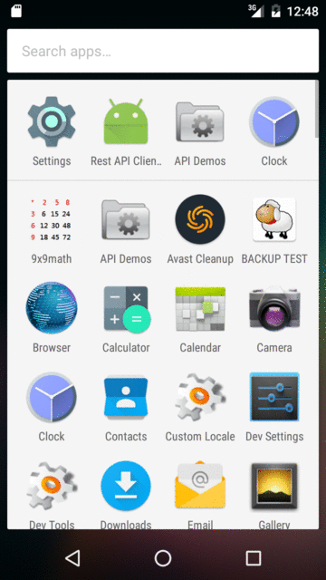
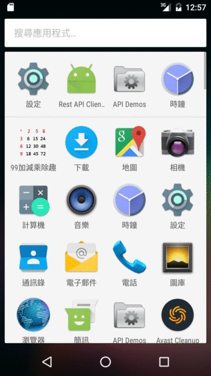
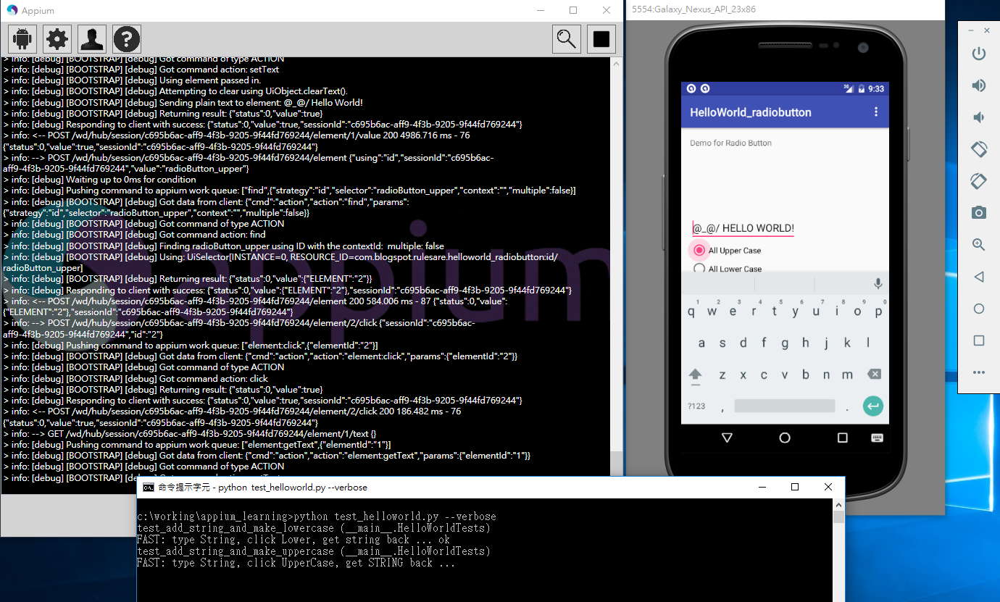

# appium practice
---


## 01_helloworld

* App source code: https://github.com/vash-hsu/android/tree/master/HelloWorld_radiobutton
* APK file: [download](01_helloworld/com.blogspot.rulesare.helloworld_radiobutton.apk)
* screenshot:
 * [screenshot](01_helloworld/illustration_01/version_1-1.PNG)
 * [screenshot](01_helloworld/illustration_01/version_1-2.PNG)
 * [screenshot](01_helloworld/illustration_01/version_2.PNG)

### Highlight

#### app
```
// for Plain Text which User type in
editText = (TextView) findViewById(R.id.editText);
stringUserDefined[0] = editText.getText().toString();

editText.addTextChangedListener(new TextWatcher() {
    @Override
    public void beforeTextChanged(CharSequence s, int start, int count, int after) {
    }

    @Override
    public void onTextChanged(CharSequence s, int start, int before, int count) {
	  // determine if it's modified by User or by other buttons
    }

    @Override
    public void afterTextChanged(Editable s) {
		if (null == editText.getTag()){
			Log.d("editText", "afterTextChanged, by user input");
			stringUserDefined[0] = editText.getText().toString();
			radiogroup_main.check(R.id.radioButton_none);
		}
		else{
			Log.d("editText", "afterTextChanged, by action of button");
		}
	}
});
```
#### appium
```
class HelloWorldTests(unittest.TestCase):

  def setUp(self):
      # type Hello World string into [editText]
      self.element_txt = self.driver.find_element_by_id("editText")
      if self.element_txt:
          self.element_txt.clear() # clean
          self.element_txt.send_keys(self.string4test) # type new string

  def test_add_string_and_make_uppercase(self):
      "FAST: type String, click UpperCase, get STRING back"
      self._click_button(self.button_id['upper']) # click [All Upper Case]
      self._string_should_be(self.string4test.upper()) # check result

  def test_add_string_and_make_lowercase(self):
      "FAST: type String, click Lower, get string back"
      self._click_button(self.button_id['lower']) # click [All Lower Case]
      self._string_should_be(self.string4test.lower()) # check result


```
---

## 02_9x9math
* App source code: https://github.com/vash-hsu/android/tree/master/9x9math
 * Java code MathGame9x9
   *  source and unitest  
    https://github.com/vash-hsu/kata/tree/master/003_number
* APK file: [download](02_9x9math/com.blogspot.rulesare.9x9math.apk)
* screenshot:

| Activity(s) | EN | TC |
|--|--|--|
| Main | .  | .  |

* Illustration for English
 * [icon](02_9x9math/illustration_01/0_app_icon.png)
 * [Main](02_9x9math/illustration_01/1_main.png)
 * [Plus](02_9x9math/illustration_01/2_plus.png)
 * [Confirm](02_9x9math/illustration_01/2_plus_confirm.png)
 * [Minus](02_9x9math/illustration_01/3_minus.png) [Times](02_9x9math/illustration_01/4_times.png)
 * [Divide](02_9x9math/illustration_01/5_divide.png)  
* Illustration for Trandition Chinese
 * [icon](02_9x9math/illustration_02/0_app_icon.png)
 * [Main](02_9x9math/illustration_02/1_main.png)
 * [Plus](02_9x9math/illustration_02/2_plus.png)
 * [Confirm](02_9x9math/illustration_02/2_plus_confirm.png)
 * [Minus](02_9x9math/illustration_02/3_minus.png)
 * [Times](02_9x9math/illustration_02/4_times.png)
 * [Divide](02_9x9math/illustration_02/5_divide.png)  


### Highlight

#### command line
```
$ adb install com.blogspot.rulesare.9x9math.apk
* daemon not running. starting it now on port 5037 *
* daemon started successfully *
[100%] /data/local/tmp/com.blogspot.rulesare.9x9math.apk
        pkg: /data/local/tmp/com.blogspot.rulesare.9x9math.apk
Success
```
```
$ adb shell am start -n com.blogspot.rulesare.a9x9math/com.blogspot.rulesare.a9x9math.MainActivity
Starting: Intent { cmp=com.blogspot.rulesare.a9x9math/.MainActivity }
```


#### app
```
package com.blogspot.rulesare.a9x9math;

public class DivideActivity extends MathActivity {

    // game logic and data structure
    protected int[] prepareBusinessLogic(){
        flag = ran.nextInt(3); // return 0, 1, 2
        intA = ran.nextInt(9)+1;
        do {
            intB = ran.nextInt(9)+1;
        }while (intB == intA);
        intA = intB * intA;
        int[] dataSet = myGame.mutate("/", intA, intB, 3, flag);
        answer = dataSet[flag];
        return (dataSet);
    }

    protected void customize_operation(){
        decide_operation("/");
    }
}

```
#### appium
```
class Math9x9Tests(unittest.TestCase):

    @classmethod
    def setUpClass(cls):
      cls.driver.implicitly_wait(10)

    def setUp(self):
      self.driver.start_activity(self.desired_caps['appPackage'],
                                 self.desired_caps['appActivity'])

    def test_gaming_divide_10_run(self):
      self._enter_game_of("divide")
      for i in xrange(10):
      op, v1, v2 = self._retrieve_expression()
      answer = self._calculate(op, v1, v2)
      self._click_button_with_answer(answer)

```


#### Hints
* UI Automator Viewer  
[screenshot](02_9x9math/illustration_03/ui_automator_viewer.png)
* unittest script on Appium without implicitly wait  
[screenshot](02_9x9math/illustration_03/without_implicitly_wait.png)
* unittest script on Appium with implicitly wait  
[screenshot](02_9x9math/illustration_03/with_implicitly_wait.png)

---
=======

# Appium

### 01_helloworld ###
demo for appium on android app with radio button  
* [blog](http://katazen.blogspot.tw/2016/09/0182-android-radio-button-example-ui.html)  
* [source code of APK](https://github.com/vash-hsu/android/tree/master/HelloWorld_radiobutton)  

